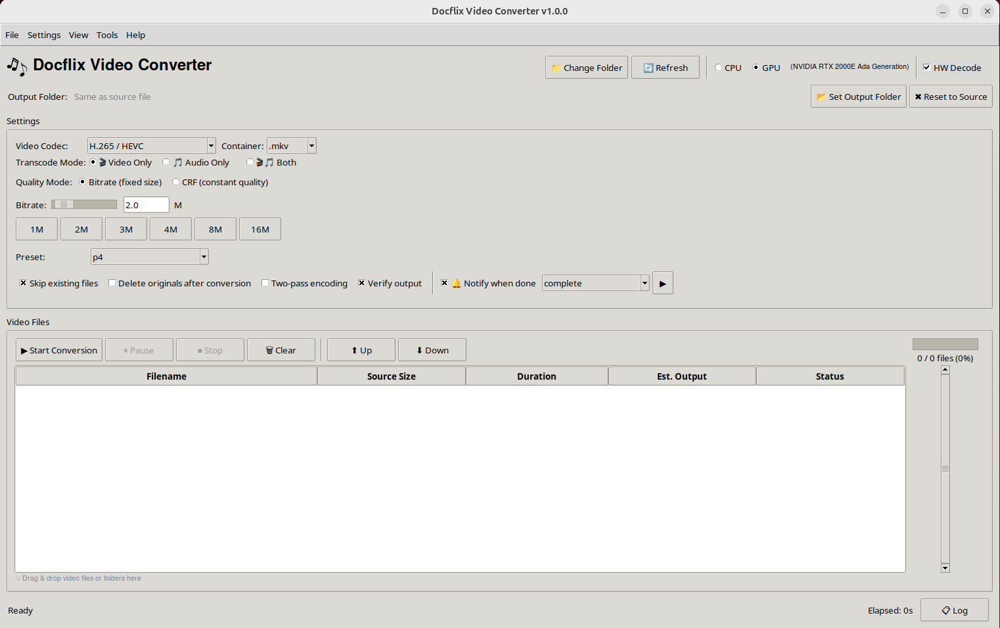

# 🎬 Docflix Video Converter

A batch video converter that encodes files to **H.265/HEVC** (and other codecs) using `ffmpeg`, with support for CPU and **multi-GPU** encoding (NVIDIA NVENC, Intel QSV, AMD VAAPI). Includes a full-featured desktop GUI, a standalone media processor for remux post-processing, a subtitle editor with OCR and Whisper-based auto-sync, a TV show renamer, and a headless CLI tool.

---

## Screenshots



---

## Features

### Desktop GUI
- 🖱️ **Drag-and-drop** file queuing
- ⚙️ **Per-file settings overrides** — different encoder settings per file
- 🎛️ **Multi-GPU encoding** — auto-detects and supports:
  - NVIDIA NVENC (presets p1–p7)
  - Intel Quick Sync Video / QSV (presets veryfast–veryslow)
  - AMD VAAPI (bitrate/QP quality control)
  - CPU fallback (libx265, libx264, libsvtav1, libvpx-vp9)
- 🔁 **Two-pass encoding** support (CPU two-pass and GPU multipass)
- 🖥️ **HW Decode** — hardware-accelerated decoding (auto-disabled for burn-in subtitles)
- 📺 **MPEG Transport Stream (.ts)** support — input/output, ATSC A53 closed caption detection, CC passthrough, CC extraction to SRT via `ccextractor`
- 📝 **External subtitle support** — drag-and-drop `.srt`, `.ass`, `.ssa`, `.vtt`, `.sub`, `.idx`, `.sup`; auto-matches by filename; embed or burn-in modes; language/default/forced flags
- 🎞️ **Internal subtitle management** — per-stream format control, codec conversion
- ✏️ **Subtitle editor** — full-featured editor with filters (Remove HI, Fix ALL CAPS, Remove Ads, etc.), search & replace, timing tools, batch processing, video preview
- 🧹 **Metadata cleanup** — strip chapters, strip tags, set track metadata (language codes for video/audio/subtitle tracks, clear container title)
- 📊 **Media info** panel — codec, resolution, duration, streams
- 🔬 **Test encode** — 30-second preview clip before full conversion
- 📐 **Estimated output size** before conversion starts
- ⏱️ **Batch ETA** — real-time estimated time remaining for the entire batch
- ▶️ **Playback** of source and output files via configurable media player
- 📁 **Open output folder** in system file manager
- 🔔 **Sound notification** on completion
- 💾 **Auto-saved preferences**
- 📂 **Recent folders** menu
- ⌨️ **Keyboard shortcuts** panel
- 🖥️ **Multi-monitor aware** — launches on the monitor containing the mouse
- 🗂️ **"Open with" support** — appears in file manager right-click menu for video files
- 📺 **TV Show Renamer** (Tools → TV Show Renamer) — batch rename TV show and movie files using **TVDB or TMDB** metadata; auto-detects show/movie names from filenames; multi-show support with disambiguation dialog (poster thumbnails, synopsis); movie support (`Name (Year).ext`); menu bar with keyboard shortcuts; configurable filename template with presets; preserves subtitle language/forced/SDH tags; language detection from subtitle content via `langdetect`

### Media Processor (Tools → Media Processor)
A standalone remux-only post-processing tool for already-encoded files — no re-encoding required (`-c:v copy`).

- 🔊 **Convert audio** — codec dropdown (aac, ac3, eac3, mp3, opus, flac, copy) + bitrate; auto-skips if source already matches target
- 🧹 **Strip chapters / tags / existing subtitles**
- 📝 **Mux external subtitles** — auto-detects `*.eng.srt` and `*.eng.forced.srt` alongside videos; sets disposition flags and track titles
- 🏷️ **Set track metadata** — per-track language codes, clear container title and track names
- ✅ **Preflight check** — validates files before processing
- All operations combined into a single ffmpeg command per file
- Drag-and-drop, progress bar, color-coded log

### Subtitle Editor (Tools → Subtitle Editor)
- Standalone and integrated modes
- Video subtitle extraction and re-mux (edit internal subtitles, save back without re-encoding)
- Filters: Remove HI, Remove Tags, Remove Ads/Credits, Remove Stray Notes, Remove Leading Dashes, Remove ALL CAPS HI, Remove Off-Screen Quotes, Remove Duplicates, Merge Short Cues, Reduce to 2 Lines, Fix ALL CAPS (with custom character names)
- Bitmap subtitle OCR (PGS/VobSub → SRT via Tesseract) with live monitor
- **Smart Sync** — Whisper-based auto-sync with two engines:
  - Standard (`faster-whisper`) — ~400ms accuracy
  - Precise (`WhisperX`) — phoneme-level ~50ms accuracy with Direct Align mode and VAD boundary snapping
- **Spell checker** with interactive correction and custom dictionary
- Search & Replace with wrap-around; persistent Search/Replace List
- **Quick Sync** — set first cue time with mpv player integration
- Timing tools: offset and stretch
- Split / Join / Insert cues
- Undo/Redo
- Batch filter for multiple files
- Batch Search & Replace with persistent pairs
- Color-coded rows, video preview via ffplay

### CLI (`convert_videos.sh`)
- Batch converts all video files in the current directory
- Supports `.mkv`, `.mp4`, `.avi`, `.mov`, `.wmv`, `.flv`, `.webm`, `.ts`, `.m2ts`, `.mts`
- CPU, NVIDIA NVENC, Intel QSV, and AMD VAAPI encoding
- Bitrate and CRF quality modes
- Configurable output filename suffix
- Optional cleanup of originals after successful conversion
- Timestamped log file per run
- Desktop notifications via `zenity` (optional)

---

## Requirements

| Dependency | Required By | Install |
|------------|-------------|---------|
| `ffmpeg` | All | `sudo apt install ffmpeg` |
| `python3` | Desktop GUI | `sudo apt install python3` |
| `tkinter` | Desktop GUI | `sudo apt install python3-tk` |
| `tkinterdnd2` | Desktop GUI (drag & drop) | `pip install tkinterdnd2` |
| `Pillow` | Desktop GUI (logo image) | `pip install Pillow` |
| `zenity` | Folder dialogs, CLI popups (optional) | `sudo apt install zenity` |
| `ccextractor` | CC extraction from .ts files (optional) | `sudo apt install ccextractor` |
| `tesseract-ocr` | Bitmap subtitle OCR (optional) | `sudo apt install tesseract-ocr tesseract-ocr-eng` |
| `pytesseract` | Python bindings for Tesseract (optional) | `pip install pytesseract` |
| `pyspellchecker` | Subtitle spell checker (optional) | `pip install pyspellchecker` |
| `faster-whisper` | Smart Sync — Standard engine (optional) | `pip install faster-whisper` |
| `whisperx` | Smart Sync — Precise engine (optional) | `pip install whisperx 'transformers<4.45'` |
| `langdetect` | Subtitle language detection (optional) | `pip install langdetect` |
| `mpv` | Quick Sync — video playback (optional) | `sudo apt install mpv` |
| NVIDIA driver + NVENC | NVIDIA GPU encoding (optional) | System-specific |
| Intel media driver + QSV | Intel QSV encoding (optional) | System-specific |
| Mesa VAAPI driver | AMD VAAPI encoding (optional) | System-specific |

---

## Installation

### Recommended — use the installer

```bash
git clone https://github.com/docman1967/docflix-video-converter.git
cd docflix-video-converter
./install.sh
```

The installer will:
- Check and report any missing system dependencies
- Install Python packages (`tkinterdnd2`, `Pillow`) for your user
- Copy app files to `~/.local/share/docflix/`
- Create a `.desktop` entry so the app appears in your system app menu
- Create a `docflix` terminal command in `~/.local/bin/`

No `sudo` required.

### Uninstall

```bash
./install.sh --uninstall
```

---

## Running Without Installing

```bash
# Desktop GUI (background, with logging)
./run_converter.sh

# Desktop GUI (foreground)
python3 video_converter.py

# Open a specific video file
docflix /path/to/video.mkv

# CLI — run from the folder containing your video files
cd /path/to/your/videos
/path/to/docflix-video-converter/convert_videos.sh
```

---

## CLI Usage

```
convert_videos.sh [OPTIONS]

Options:
  -b, --bitrate VALUE     Video bitrate (default: 2M)
  -q, --crf VALUE         CRF quality value — disables bitrate mode (0–51)
  -p, --preset PRESET     CPU encoding preset (default: ultrafast)
  -g, --gpu               Use NVIDIA GPU encoding (hevc_nvenc)
  --qsv                   Use Intel Quick Sync Video (hevc_qsv)
  --vaapi                 Use VAAPI encoding (hevc_vaapi)
  -P, --gpu-preset PRESET GPU preset (NVENC: p1–p7, QSV: veryfast–veryslow)
  -s, --suffix SUFFIX     Output filename suffix (default: -2mbps-UF_265)
  -o, --overwrite         Overwrite existing output files
  -c, --cleanup           Delete originals after successful conversion
  -n, --no-log            Disable log file
  -h, --help              Show usage
```

### Examples

```bash
# CPU encoding, default bitrate (2M), ultrafast preset
./convert_videos.sh

# GPU encoding (NVIDIA), fastest preset
./convert_videos.sh --gpu

# Intel QSV encoding
./convert_videos.sh --qsv

# AMD VAAPI encoding
./convert_videos.sh --vaapi

# CRF quality mode
./convert_videos.sh --crf 22

# GPU, high quality preset, overwrite existing files
./convert_videos.sh --gpu --gpu-preset p5 --overwrite
```

---

## Encoding Reference

### CPU (`libx265`)

| Mode | Flag | Recommended Range |
|------|------|-------------------|
| Bitrate | `-b:v` | `1M` – `8M`+ |
| CRF | `-crf` | `18`–`28` (lower = better quality) |

**Presets (fastest → best quality):**
`ultrafast` · `superfast` · `veryfast` · `faster` · `fast` · `medium` · `slow` · `slower` · `veryslow`

### NVIDIA GPU (`hevc_nvenc`)

| Mode | Flag | Recommended Range |
|------|------|-------------------|
| Bitrate | `-b:v` | `1M` – `8M`+ |
| CQ | `-cq` | `15`–`25` (lower = better quality) |

**Presets:** `p1` · `p2` · `p3` · `p4` · `p5` · `p6` · `p7`

### Intel GPU (`hevc_qsv`)

| Mode | Flag | Recommended Range |
|------|------|-------------------|
| Bitrate | `-b:v` | `1M` – `8M`+ |
| Quality | `-global_quality` | `15`–`25` (lower = better quality) |

**Presets:** `veryfast` · `faster` · `fast` · `medium` · `slow` · `slower` · `veryslow`

### AMD GPU (`hevc_vaapi`)

| Mode | Flag | Recommended Range |
|------|------|-------------------|
| Bitrate | `-b:v` | `1M` – `8M`+ |
| Quality | `-qp` | `15`–`25` (lower = better quality) |

> **Note:** GPU encoding is significantly faster but may produce slightly larger files at equivalent quality settings.

---

## Project Structure

```
docflix-video-converter/
├── video_converter.py    # Desktop GUI application (~16,900 lines, Tkinter)
├── convert_videos.sh     # Headless CLI batch converter
├── run_converter.sh      # Desktop GUI launcher (background + logging)
├── install.sh            # Installer / uninstaller
├── scripts/
│   └── media-process.sh  # Reference bash script for remux pipeline
├── logo.png              # App icon
├── LICENSE               # MIT License
└── README.md             # This file
```

---

## Keyboard Shortcuts

| Shortcut | Action |
|----------|--------|
| `Ctrl+O` | Open File(s) |
| `Ctrl+Shift+O` | Open Folder |
| `Ctrl+P` | Play Source File |
| `Ctrl+Shift+P` | Play Output File |
| `Ctrl+I` | Media Info |
| `Ctrl+T` | Test Encode (30s) |
| `Ctrl+M` | Media Processor |
| `Ctrl+Shift+F` | Open Output Folder |
| `Ctrl+L` | Show/Hide Log |
| `Ctrl+Shift+S` | Show/Hide Settings Panel |
| `F1` | Keyboard Shortcuts |
| `Ctrl+Q` | Exit |

---

## License

[MIT](LICENSE) © 2026 Tony Davis
